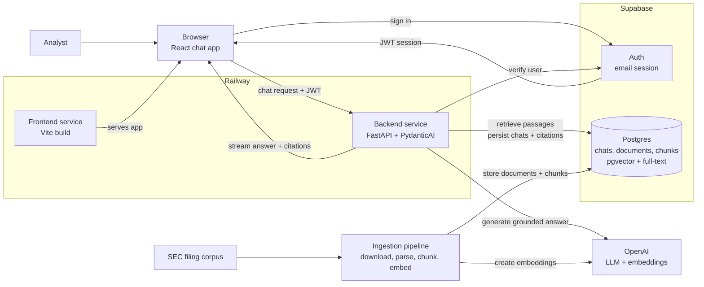

# RAG Document Assistant — Architecture

## Purpose

This assistant is an internal research tool for analysts who need grounded answers from a curated SEC filing corpus. The architecture optimizes for **trust**: every answer is generated from retrieved source passages, every factual claim is citable, and the system fails clearly when the corpus does not support an answer.

## High-Level Architecture



## System Boundaries

- **Frontend**: renders chat state, manages the user's Supabase session, streams assistant responses. Never holds service-role credentials or calls OpenAI directly.
- **Backend**: request authorization, retrieval, prompt construction, LLM execution, citation validation, streaming responses, durable persistence. Owns all privileged credentials.
- **Supabase**: authentication and durable product state. Browser uses anon key + user JWT; backend uses service-role key for privileged writes.

## Request Flow

1. User signs in with Supabase email auth in the React SPA.
2. Frontend stores the Supabase session via `@supabase/supabase-js`.
3. User sends a question; frontend POSTs to FastAPI with `Authorization: Bearer <supabase_jwt>`.
4. FastAPI verifies the token with Supabase Auth before doing any retrieval or LLM work.
5. A PydanticAI agent retrieves relevant document chunks via hybrid search (pgvector + full-text + RRF fusion).
6. Agent generates a grounded answer with citations and streams it back via SSE.
7. FastAPI persists the final message, citations, and usage metadata to Supabase.

## Retrieval Strategy (Hybrid)

1. Embed the user's query with OpenAI `text-embedding-3-small`.
2. Run a semantic search over `document_chunks.embedding` with `pgvector`.
3. Run a lexical search over `document_chunks.search_vector` with Postgres full-text search.
4. Fuse the two ranked lists in Python with **Reciprocal Rank Fusion (RRF)**.
5. Fetch selected chunks, source document metadata, and optional neighboring chunks for grounding.

## Data Model

| Table | Purpose |
|-------|---------|
| `profiles` | One row per authenticated user |
| `chat_threads` | Thread metadata, owner, timestamps |
| `chat_messages` | User and assistant messages in order |
| `message_citations` | Citation records linked to assistant messages |
| `source_documents` | Original filing metadata + normalized Markdown |
| `document_chunks` | Chunk text, embedding, tsvector, metadata JSON |

## Backend Module Layout

```
backend/app/
├── api/            # FastAPI routers (auth, chat)
├── auth/           # Supabase JWT verification
├── assistant/      # PydanticAI agent, outputs, deps
├── chat/           # Turn orchestration, SSE streaming
├── retrieval/      # pgvector + full-text queries, RRF fusion
├── grounding/      # Citation validation
└── database/       # SQLAlchemy models, Supabase client, queries
```

## Grounding Policy

- Every answer must have at least one citation, or explicitly state the corpus lacks evidence.
- Every citation maps to a retrieved source passage.
- The model cannot cite documents not retrieved for the current request.
- If citation validation fails, the backend returns a controlled error — not a polished unsupported answer.

## Configuration

**Backend** (`app/config.py`): `SUPABASE_URL`, `SUPABASE_ANON_KEY`, `SUPABASE_SERVICE_ROLE_KEY`, `DATABASE_URL`, `OPENAI_API_KEY`, `ALLOWED_ORIGINS`

**Frontend** (`src/lib/env.ts`): `VITE_API_BASE_URL`, `VITE_SUPABASE_URL`, `VITE_SUPABASE_ANON_KEY`

No other file should read environment variables directly.
